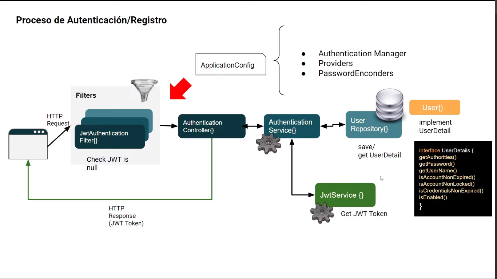
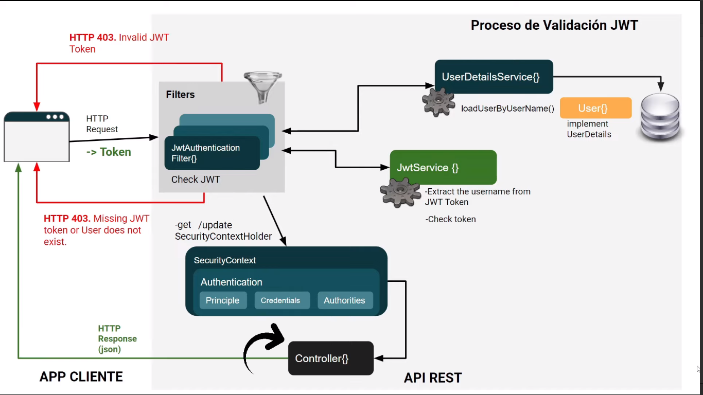

# Spring REST JWT Security Demo Project

___

### Descripción

Este proyecto fue creado siguiendo el tutorial de la profesora ***Ivana Soledad Rojas Córsico***
([**Perfil de GitHub**]("https://github.com/irojascorsico")) a quién le agradezco su forma tan clara de explicar.<br>
El objetivo de este repositorio es compartir el conocimiento y habilidades adquiridas en el tutorial.
el repositorio original del proyecto se encuentra en el siguiente enlace
[**Repositorio de la profesora**]("https://github.com/irojascorsico/spring-boot-jwt-authentication/tree/v1.0").

---

El tutorial explica la implementación de un sistema de autenticación y autorización de usuarios en una API REST
utilizando JWT.

El proyecto fue desarrollado utilizando las siguientes tecnologías:

- Spring Boot 3
- Spring Security 6
- JWT Authentication

Se siguio el siguiente diagrama para la autenticación/registro de usuarios:



Y el siguiente diagrama de validación de token:



---

### Endpoints de la API

##### /auth/login [**POST**]

Este endpoint recibe un objeto JSON con los datos de usuario y contraseña, si los datos son correctos se genera un token
JWT y se devuelve en la respuesta.

```http request
POST http://localhost:8080/auth/login
Content-Type: application/json

{
  "username": "string",
  "password": "string"
}

```

##### /auth/register [**POST**]

Este endpoint recibe un objeto JSON con los datos de usuario para registrarlo en la base de datos.

```HTTP request
POST http://localhost:8080/auth/register
Content-Type: application/json

{
  "username": "string",
  "password": "string",
  "firstName": "string",
  "lastName": "string",
  "country": "string"
}
```

##### /api/v1/demo [**POST**]

Este endpoint es el único que requiere autenticación, se debe mandar el token JWT en el header Authorization para poder
acceder a él.

```HTTP request
POST http://localhost:8080/api/v1/demo
Authorization: Bearer {{token}}

```